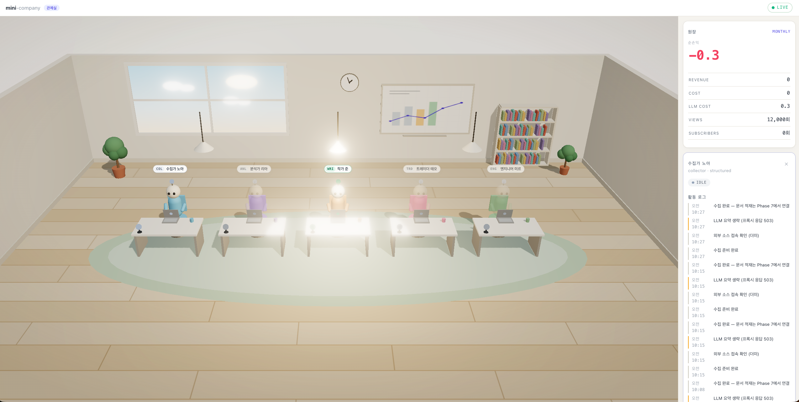

# mini-company

AI 직원(에이전트)이 수행한 작업을 3D 오피스로 시각화하고, 수집한 데이터를 RAG로 적재해서
나만의 에이전트 오피스를 만들어보세요.



- 설계: [`docs/PROJECT_BLUEPRINT.md`](docs/PROJECT_BLUEPRINT.md)
- 에이전트 코딩 규칙: [`AGENTS.md`](AGENTS.md)

## 무엇을 하는 화면인가

```
[+ 직원 채용]  →  아바타 클릭  →  [일 시키기]  →  에이전트가 집어감  →  결과 보고
   이름·직무        상세 패널       종류 + 한 줄       하네스 실행         작업 목록 + 말풍선
```

1. **채용** — 이름과 직무만 정한다. 책상 자리와 LLM 프로파일은 서버가 직무에서 정한다.
2. **일 시키기** — 종류(수집·분석·보고서)와 한 줄 지시. 상태는 `QUEUED`로 들어간다.
3. **에이전트가 집어간다** — `agent` 프로세스가 대기열을 폴링해 원자적으로 클레임하고
   `RUNNING`으로 바꾼다. 여기서 직원 아바타가 초록으로 바뀐다.
4. **하네스 안에서 워크플로우 실행** — 단계마다 활동을 남기고(말풍선), 끝나면 요약을 쓴다.
   실패하든 취소되든 하네스가 반드시 마감한다.

| 시킬 수 있는 일 | 하는 일 | 제목의 쓰임 |
|---|---|---|
| 자료 수집 | 외부 소스 → 파싱·청킹·임베딩 → 지식 베이스 | 기록용 |
| 자료 분석 | 지식 검색 → LLM으로 요점 정리 | **검색어** |
| 보고서 작성 | 근거 검색 → LLM으로 문장 작성 | **주제** |

새 종류는 `workers/src/workflows/`에 함수 하나를 추가하고 레지스트리에 등록하면 된다 —
에이전트 루프는 고치지 않는다.

> **`QUEUED`에서 안 움직인다면** `agent` 프로세스가 떠 있지 않은 것이다.
> `docker compose --profile app up -d agent` 또는 `make agent`.

## 현재 진행 상황

| Phase | 산출물                                                      | 상태 |
|-------|----------------------------------------------------------|----|
| 0     | 스캐폴딩, 인프라(Mongo replica set / Milvus), 설정, 헬스 프로브        | 완료 |
| 1     | `employees` 도메인 (router→service→repository), 시드, 계약 테스트  | 완료 |
| 2     | `tasks`+`activities` 도메인, 내부 API(`X-Worker-Key`), 워커 하네스 | 완료 |
| 3     | `ledger` 기록·집계·역분개·렌더러, 숫자 무결성 테스트                       | 완료 |
| 4     | `llm` 게이트웨이 (프로파일·단가·비용 자동 기록·폴백), MiniMax/Anthropic 어댑터 | 완료 |
| 5     | `realtime` EventBus + WS 허브 + `/office/snapshot`         | 완료 |
| 6     | 프론트 Three.js 씬 + 아바타 + 말풍선 + 원장 패널                       | 완료 |
| 7     | `knowledge` 적재(HTML/PDF/MD/줄글) + 메타 추출 + 청킹 전략 3종 + Milvus 검색 | 완료 |
| 8     | `chat` RAG 챗봇 + 출처 인용 + 원장 툴                              | 완료 |
| 9     | 스케줄러, 멈춘 작업 자동 회수, 연결 재시도, JSON 로깅, graceful shutdown     | 완료 |
| 10    | kind 클러스터에 앱 배포(DB는 호스트 compose), Ingress·프로브·kustomize      | 완료 |
| 11    | Mongo/Milvus StatefulSet 이전, Secret/ConfigMap 분리, 키 로테이션, CronJob | 완료 |
| 12    | Redis EventBus 전환 → backend replica 2                       | 완료 |

## 실행

```bash
cp .env.example .env
python3 -m venv backend/.venv && backend/.venv/bin/pip install -e 'backend[dev]'
python3 -m venv workers/.venv && workers/.venv/bin/pip install -e 'workers[dev]'

# 1) 인프라만 컨테이너로 (개발 중 권장)
make up
make indexes && make seed
make dev
curl -s localhost:8000/api/v1/employees

# 2) 백엔드 + 프론트까지 컨테이너로
make up-all
open http://localhost:5173        # 3D 관제실
```

프론트를 따로 개발할 때는 백엔드가 먼저 떠 있어야 한다(`/api`를 프록시한다):

```bash
cd frontend && npm install
make dev-front                    # http://localhost:5173
make test-front                   # 타입체크 + 단위 테스트
```

더미 워커 1회 실행 (백엔드와 시드가 먼저):

```bash
make worker-demo
curl -s localhost:8000/api/v1/tasks
# 활동 로그 확인
EMPLOYEE_ID=$(curl -s localhost:8000/api/v1/employees | jq -r '.[0].id')
curl -s "localhost:8000/api/v1/employees/${EMPLOYEE_ID}/activities"
```

`make up` 직후 Milvus는 부팅에 1분 가까이 걸린다. `docker compose ps`로 `healthy`를 확인한다.

```bash
make test        # 백엔드 단위 테스트. 인프라 불필요, DB 없이 돈다
make test-int    # 통합/계약 테스트. 인프라 필요
make test-e2e    # e2e (작업 1건 여정). 인프라 필요
make test-worker # 워커 단위 테스트. 인프라 불필요
make lint        # ruff
make indexes     # 인덱스 생성 (K8s에서는 Job)
make seed        # 직원 5명 시드 (멱등)
make worker-demo # 더미 수집 워커 1회 실행
make down        # 정지
make clean       # 볼륨까지 삭제
```

## API

```
GET  /health/live                                   # 의존성 검사 없음
GET  /health/ready                                  # mongo + milvus 검사, 실패 시 503
GET    /api/v1/employees?role=&status=
POST   /api/v1/employees                            # 채용 (자리·프로파일은 서버가 정한다)
GET    /api/v1/employees/{id}
PATCH  /api/v1/employees/{id}                       # 이름·직무 변경 (프로파일도 함께)
DELETE /api/v1/employees/{id}                       # 해고. 작업 중이면 409
GET  /api/v1/employees/{id}/activities?limit=&cursor=   # { items, nextCursor }
GET    /api/v1/tasks?employee_id=&status=
POST   /api/v1/tasks                                # 일 시키기 → QUEUED
POST   /api/v1/tasks/{id}/cancel                    # 대기 중인 지시 취소
GET  /api/v1/ledger/summary?period=daily|monthly|all    # 서버가 aggregate한 값만
GET  /api/v1/knowledge/documents?limit=              # 수집 문서 목록
GET  /api/v1/knowledge/documents/{id}                # 원문 메타 상세
GET  /api/v1/knowledge/search?q=&topK=&sourceType=   # 벡터 검색 (임계값 미달은 제외)
POST /api/v1/chat/conversations                      # 대화 시작
POST /api/v1/chat/conversations/{id}/messages         # 질문 → 근거 달린 답변
GET  /api/v1/office/snapshot                        # 직원 전체 + 원장 요약 (진입 시 1회)
WS   /api/v1/ws/office                              # 이후의 변화분만

# 내부 (워커 전용, X-Worker-Key 헤더 필수)
POST  /internal/v1/tasks                            # 워커가 스스로 시작 (스케줄 실행)
POST  /internal/v1/tasks/claim                      # 지시받은 일을 집어감 → RUNNING
POST  /internal/v1/tasks/{id}/activities            # 활동 로그 1건 (append-only)
PATCH /internal/v1/tasks/{id}                       # SUCCEEDED/FAILED → 직원 IDLE/ERROR
POST  /internal/v1/ledger/entries                   # 원시 트랜잭션 (append-only)
POST  /internal/v1/ledger/entries/{id}/reversal     # 역분개: 서버가 반대 부호로 기록
POST  /internal/v1/llm/completions                  # LLM 프록시 (모델은 서버가 결정)
POST  /internal/v1/knowledge/documents              # 문서 적재 (파싱·청킹·임베딩은 서버가)
POST  /internal/v1/knowledge/documents/{id}/reindex # 청킹·모델 변경 후 재인덱싱
```

## LLM 게이트웨이 (§8 — 키·모델·비용의 단일 관문)

모든 LLM 호출이 백엔드를 경유한다. 워커·프론트는 프로바이더 SDK를 갖지 않는다(ADR-007).

- **키는 백엔드 프로세스에만** 있다. K8s로 가도 Secret 마운트 지점이 하나다.
- **모델 선택 권한이 워커에 없다.** 요청에 `model` 필드가 없고, 직원의 `llmProfile`이 정한다.
- **비용을 우회할 수 없다.** 토큰 사용량 → 자체 단가표 → `LedgerEntry(LLM_COST)` 자동 기록.
  프로바이더가 응답에 비용을 담아 보내도 쓰지 않는다(`LlmResult`에 비용 필드가 없다).
- 프로파일 실패 시 `fallback`으로 **1홉만** 재시도하고 Activity에 WARN을 남긴다.
- `LLM_DAILY_COST_LIMIT_KRW` 초과 시 프로바이더를 호출하기 전에 429로 거부한다.

3계층 분리 — 키는 환경변수(Secret), 카탈로그는 코드+`LLM_PROFILES_JSON`(ConfigMap),
직원별 선택은 MongoDB(`Employee.llm_profile`). DB에는 프로파일 **이름만** 저장한다.

부팅 시 카탈로그를 검증한다: 알 수 없는 프로바이더, 없는 fallback, 1홉 초과 폴백,
단가 없는 모델 → **부팅 거부**. 키 누락은 `APP_ENV=local`에서만 경고로 넘어간다
(LLM이 필요 없는 작업 중에 앱이 아예 안 뜨면 개발이 막힌다).

```bash
# 키 없이 전 경로를 확인하려면 base_url을 로컬 목 서버로 돌린다
MINIMAX_API_KEY=dummy MINIMAX_BASE_URL=http://localhost:18080/v1 make dev
```

### 로컬 모델 (Ollama)

API 키 없이 **진짜 LLM으로** 전 경로를 돌리는 방법이다. 목 서버와 달리 실제 생성 품질과
지연을 그대로 본다.

```bash
ollama pull anpigon/eeve-korean-10.8b     # 7.7GB
ollama serve                              # 이미 떠 있으면 생략

# .env
OLLAMA_ENABLED=true
CHAT_LLM_PROFILE=local                    # 챗봇이 로컬 모델을 쓰게 한다

make dev
```

`OLLAMA_ENABLED=true` 하나면 된다. 게이트웨이가 `local` 프로파일과 **단가 0**을 카탈로그에
자동으로 넣는다 — 둘 중 하나만 빠져도 부팅이 거부되므로, 그 조합을 손으로 쓰게 하지 않는다.
`LLM_PROFILES_JSON`/`LLM_PRICING_JSON`에 `local`을 직접 정의하면 그쪽이 이긴다.

| 항목 | 값 | 이유 |
|---|---|---|
| `OLLAMA_MODEL` | `anpigon/eeve-korean-10.8b:latest` | 한국어 답변 품질이 쓸 만하다 |
| `OLLAMA_TIMEOUT_SECONDS` | `300` | 공용 60초로는 긴 답변이 늘 잘린다(애플 실리콘 대략 10 tok/s) |
| 단가 | `0` | 호출당 청구가 실제로 없다. "몰라서 0"이 아니라 "0인 걸 안다" |
| `local` 프로파일 `max_tokens` | `2,000` | 로컬은 토큰당 시간이 길어 8,000이면 한 번의 채팅이 수 분이다 |

비용 기록 경로는 살아 있다. 원장에 `0원 / ollama/<모델> (local)`로 남아 호출 횟수와
토큰 수를 추적할 수 있다 — 전기값을 계산하고 싶으면 `LLM_PRICING_JSON`에 단가만 채운다.

**작은 모델에서 드러난 것**: `[1]` 인용 표기를 자주 `[자료]`로 흘린다. 그래도 화면 출처는
정확한데, `citations`를 LLM 출력 파싱이 아니라 검색 결과로 서버가 채우기 때문이다. 설계가
모델 품질을 흡수하는 지점이라 그대로 둔다.

## 숫자 무결성 (§7 — 이 프로젝트의 심장)

- 화면·요약문의 모든 수치는 `ledger_entries`를 서버가 aggregate한 값이다. 워커는 원시 트랜잭션만 기록한다.
- 금액은 `Decimal`(도메인) ↔ `Decimal128`(Mongo). `$sum`도 Decimal128 위에서 돌아 `0.1 × 3 = 0.3`이다.
- `unit`은 요청에서 받지 않는다 — 카테고리가 결정한다. 같은 카테고리에 KRW와 count가 섞이면 합계가 조용히 무의미해진다.
- 정정은 UPDATE가 아니라 **반대 부호의 새 엔트리**다. 금액을 요청에서 받지 않고 서버가 원본에서 파생한다.
  같은 엔트리의 두 번째 역분개는 409, DB에서도 partial unique 인덱스로 막힌다.
- 요약문의 `{{ledger.revenue.monthly}}`는 서버가 치환한다. 알 수 없는 자리표시자나 남은 `{{`는 예외로 발행을 중단시킨다.

## 실시간 채널 (Phase 5)

스냅샷과 WS가 **짝**이다. 진입 시 `/office/snapshot`으로 현재 상태를 받고, 이후 변화분만
WS로 받는다. **재연결 시에는 반드시 스냅샷을 다시 조회해야 한다** — 이벤트만 이어받으면
끊긴 동안의 변경이 영구히 유실된다.

```jsonc
{ "type": "employee.status_changed", "data": { "employeeId": "…", "status": "WORKING" } }
{ "type": "activity.created",        "data": { "message": "수집 준비 완료", "level": "INFO" } }
{ "type": "ledger.summary_updated",  "data": { "totals": { … }, "net": "-0.3" } }
```

- `type`이 판별자인 discriminated union이라 프론트가 `switch (event.type)` 하나로 분기한다.
- 숫자는 전부 문자열이다. 이벤트의 원장 값도 서버가 aggregate한 결과다(ADR-002).
- 발행은 **상태를 바꾼 service**가 한다. 상태 전이와 발행이 갈라지면 화면이 조용히 멈춘다.
- 브로드캐스트는 `EventBus`를 경유한다(ADR-008). 구현은 `EVENT_BUS`가 고른다.

### 이벤트 버스 두 가지 (Phase 12)

| `EVENT_BUS` | 구현 | 쓰는 곳 |
|---|---|---|
| `memory` (기본) | `InMemoryEventBus` | 로컬 개발, replica 1. 부팅 시 경고를 남긴다 |
| `redis` | `RedisEventBus` | replica 2 이상. `REDIS_URL` 필요 |

WS 연결은 특정 Pod에 묶인다. 상태를 바꾼 Pod와 그 사용자의 WS가 붙은 Pod가 다르면
인메모리 버스로는 이벤트가 닿지 않는다 — Redis Pub/Sub이 그 사이를 잇는다.

**발행한 Pod도 Redis를 한 바퀴 돌아 받는다.** 로컬 지름길을 두지 않는 이유는, 그러면
"발행한 Pod에서는 되는데 다른 Pod에서는 안 되는" 차이가 생기고 그건 replica 1인 개발
환경에서 절대 드러나지 않기 때문이다. 같은 경로를 강제하면 개발 중 동작이 곧 운영 동작이다.

발행 실패는 로그만 남기고 삼킨다. 이벤트 전달이 업무 트랜잭션을 되돌리면 안 되고,
놓친 화면은 재연결 시 스냅샷으로 복구된다 — 원장 기록이 사라지는 것과는 성격이 다르다.
같은 이유로 **redis는 readiness에 넣지 않는다.** 버스가 죽어도 API는 답해야 한다.

## 프론트엔드 (Phase 6)

프레임워크 없이 TypeScript + Three.js + Vite다. UI 상태가 실제로 복잡해지기 전까지는
`store → 구독 → 렌더` 한 방향으로 충분하다.

- **CORS를 열지 않는다.** 개발 서버(vite proxy)와 프로덕션(nginx)이 `/api`를 백엔드로
  프록시해 브라우저 기준 동일 출처를 만든다. 프론트 코드가 환경을 구분하지 않는다.
- **프론트는 계산하지 않는다**(ADR-006). `store`는 서버가 준 값을 갈아끼우기만 하고,
  타입도 금액을 `string`으로 못박아 산술을 막는다. 허용되는 변환은 천 단위 콤마뿐이고
  `Number()`를 거치지 않아 정밀도가 보존된다.
- **상태색의 단일 출처는 CSS다.** `tokens.css`의 hex를 `scene/palette.ts`가 읽어 three의
  Color로 바꾼다 — 3D와 DOM이 같은 초록/빨강을 쓴다.
- 캐릭터는 GLTF 없이 박스+구 프리미티브다(§12). 말풍선은 `CSS2DRenderer` DOM 라벨이라
  한글 줄바꿈이 공짜다. `prefers-reduced-motion`을 존중한다.
- 번들: JS 135 kB gzip, CSS 2.3 kB gzip (App page 예산 300/50 kB 이내).


## 지식 적재 (Phase 7 — 포맷이 늘어난다는 전제)

수집 대상은 HTML·PDF·마크다운·줄글이고 **앞으로 늘어난다.** 그래서 포맷별 처리를
레지스트리 뒤에 두었다.

```
knowledge/parsing/
├── base.py      DocumentParser Protocol + 공통 헬퍼
├── plain_text.py / markdown.py / html_document.py / pdf_document.py
└── registry.py  포맷 → 파서
```

**새 포맷 추가는 파서 파일 하나 + `ContentType` 한 줄 + registry 한 줄이다.**
service·router·모델은 수정하지 않는다. 등록을 잊으면 부팅이 거부된다(`missing_parsers`).

**파싱은 워커가 아니라 백엔드가 한다**(ADR-001). 메타 추출 규칙이 워커마다 갈라지면
같은 HTML에서 다른 제목이 나온다. 워커는 "어디서 무슨 포맷으로 가져왔는지"만 알린다.

### 메타데이터 — 정규 필드 + extra

같은 뜻을 부르는 이름이 소스마다 다르다(`og:title` / `<title>` / PDF `/Title`).
파서가 그 차이를 흡수해 **정규 필드**를 채우고, 흡수되지 않은 것은 **버리지 않고 `extra`**에
남긴다. 지금 안 쓰는 태그가 나중에 필요해질 수 있고, 원문을 다시 긁는 비용이 저장보다 크다.

| 필드 | HTML 우선순위 | PDF |
|---|---|---|
| title | `og:title` → `<title>` → `twitter:title` | `/Title` |
| author | `author` → `article:author` | `/Author` |
| description | `og:description` → `description` | `/Subject` |
| publishedAt | `article:published_time` → `date` → `<time datetime>` | `/CreationDate` |
| language | `<html lang>` → `og:locale` | — |
| keywords | `keywords` (콤마 분리) | `/Keywords` |
| extra | 나머지 `og:*`·`twitter:*`·사이트 고유 태그 | `/Producer`, `page_count` |

워커가 이미 아는 메타(RSS 피드명 등)는 `metadata`로 넘기면 **파서 추출값 위에 덮인다** —
명시적으로 준 값이 이긴다.

### 중복·멱등

`content_hash`는 **파싱된 텍스트**로 계산한다. 같은 기사를 HTML로 한 번, PDF로 한 번
받으면 바이트는 달라도 내용은 같다. 재적재는 오류가 아니라 `skippedDuplicate: true`다.

재인덱싱은 `doc_id` 기준 **delete → insert**다. upsert면 문서가 짧아졌을 때 남은 옛 청크가
검색에 계속 잡힌다.

### 청킹 전략 — 문서마다 "의미 있는 조각"의 기준이 다르다

전략을 하나로 통일하면 어느 쪽이든 나빠진다. 목차가 있는 기술 문서는 절 단위로 잘라야
한 청크가 하나의 주제를 담고, 표·로그처럼 구조가 없는 텍스트는 고정 크기가 낫다.

```
knowledge/chunking/
├── base.py        ChunkingStrategy Protocol + Section + 공통 분할 헬퍼
├── paragraph.py / fixed_size.py / heading.py
└── registry.py    이름 → 전략, 포맷별 기본값
```

| 전략 | 기준 | 쓰는 곳 |
|---|---|---|
| `paragraph` | 문단 → 문장 → 문자 | 구조를 모르는 문서. 글쓴이가 표시한 경계를 지킨다 |
| `heading` | 제목 태그(h1~h6, `#`) | 목차가 있는 문서. 청크마다 제목 경로를 붙인다 |
| `fixed_size` | 고정 문자 수 | 표·로그·줄바꿈 없는 스크래핑. 크기가 균일해 비용이 예측 가능 |

**새 전략 추가는 전략 파일 하나 + registry 한 줄이다.** service·router·모델은 수정하지 않는다.

기본값은 **포맷**이 정한다 — HTML·MARKDOWN은 `heading`, PDF·줄글은 `paragraph`.
`ContentType`을 추가하고 기본 전략을 빠뜨리면 부팅이 거부된다(`missing_default_strategies`).

목차 청킹의 핵심은 **제목 경로 접두어**다. 조각만 떼어 임베딩하면 "1.1절의 내용"이라는
정보가 사라지는데, 경로가 있으면 청크 자체가 문맥을 갖는다:

```
[1장 시장 개요 > 1.1 수요 배경]
클라우드 사업자들이 서버 증설을 재개했다. 전년 대비 발주가 늘었다.
```

이게 가능하려면 **파서가 구조를 보존해야 한다.** `ParsedDocument.outline`이 그 통로이고,
HTML은 `h1~h6`, Markdown은 `#` 레벨(코드 펜스 안은 제외)에서 절을 뽑는다. 구조를 알 수
없는 포맷은 비워 두고, `heading` 전략이 스스로 `paragraph`로 폴백한다.

`SourceDocument`는 `outline`과 `chunkingStrategy`를 함께 저장한다. 원본 바이트를 보관하지
않으므로 재인덱싱 때 다시 파싱할 수 없고, 이게 없으면 같은 문서가 최초 적재와 다르게 잘린다.

```bash
# 전략을 지정해 적재 (문서 성격을 아는 호출자만)
POST /internal/v1/knowledge/documents   {"chunkingStrategy": "fixed_size", ...}

# 전략을 바꿔 재인덱싱. 비우면 최초 적재에 쓴 전략을 그대로 재현한다
POST /internal/v1/knowledge/documents/{id}/reindex   {"chunkingStrategy": "heading"}
```

우선순위는 **요청 → `CHUNKING_STRATEGY` 설정 → 포맷 기본값**이다. 요청이 이기는 이유는
문서 성격을 아는 쪽이 호출자이기 때문이다(표를 덤프한 HTML이면 `heading`이 아니라
`fixed_size`가 맞고, 그건 가져온 쪽만 안다).

### 임베딩 프로바이더

| 값 | 용도 |
|---|---|
| `hashing` | **개발용.** 키 없이 적재→검색→인용 전 경로를 돌린다. 의미를 모르는 bag-of-words라 검색 품질은 무의미하다 |
| `openai` | 실제 임베딩. `OPENAI_API_KEY` 필요 |

**임계값은 프로바이더에 종속된다.** 실측(hashing, 같은 문서):

```
"반도체 수요"                → 0.354
"메모리 반도체 수요가 회복"    → 0.500
"반도체 수요는 어떤가요"       → 0.35 미달   ← 조사가 붙으면 유사도가 급락
```

그래서 `hashing`으로 개발할 때는 `RAG_SCORE_THRESHOLD=0.1` 정도가 필요하다.

`EMBEDDING_DIM`이 기존 Milvus 컬렉션과 다르면 **부팅을 거부한다**(§15-1). 통과시키면
예외 없이 검색 품질만 조용히 망가진다.

## RAG 챗봇 (Phase 8)

```
질문 → 임베딩 → 벡터 검색 → 임계값 통과한 근거가 없으면? → LLM을 부르지 않고 거절
                                     ↓ 있으면
                      원장 요약 주입 → LLM → 답변 + citations
```

- **근거가 없으면 LLM을 호출하지 않는다.** 물어보면 그럴듯한 답을 만들어내므로, 출처 없는
  답변을 막는 지점은 검색 단계여야 한다. 거절 시 `grounded: false`, 비용 0.
- **`citations`는 서버가 검색 결과로 채운다.** LLM 출력에서 `[1]`을 파싱하지 않는다 —
  모델이 표기를 빼먹는 순간 출처 없는 답변이 통과한다.
- **원장 요약을 항상 주입한다.** blueprint는 "숫자 질문 감지 시"라고 하지만 감지 미탐이
  나면 모델이 숫자를 지어낸다. 요약은 열 줄이 안 되므로 항상 넣는 편이 싸다.
- 답변에 근거 없는 숫자가 있으면 경고 로그를 남긴다(하드 차단은 오탐이 많다 — §7.3).
- 챗봇 비용도 원장에 기록된다(`employee_id: null`) — 챗봇 비용도 회사 손익이다.


## 무인 운영 (Phase 9)

사람이 워커를 직접 실행하지 않아도 하루가 돌아가야 한다. 네 가지가 그것을 지탱한다.

### 스케줄러 — "매일 11시에 해라"

```bash
make scheduler                              # 로컬(기본: 0 11 * * *, Asia/Seoul)
docker compose --profile scheduler up -d    # 컨테이너
```

`workers/src/scheduler.py`가 크론으로 잡을 띄운다. **새 주기 작업은 `_JOBS`에 한 줄**이고,
K8s로 가면 이 파일을 지우고 CronJob이 같은 함수를 `python -m src.employees.collector`로
한 번 호출한다(§10.2) — 그래서 잡 본체와 스케줄링을 분리했다.

- `max_instances=1` — 앞 실행이 돌고 있으면 새로 띄우지 않는다. 같은 직원에게 두 작업을
  시키면 `EmployeeBusy`(409)가 난다.
- `coalesce` + `misfire_grace_time` — 프로세스가 잠깐 멈췄다 살아나면 놓친 실행을 한 번만 따라잡는다.
- 잡이 예외를 던져도 스케줄러는 죽지 않는다. 죽으면 이후 **모든** 주기 작업이 멈춘다.

### 멈춘 작업 자동 회수

워커가 SIGKILL로 죽으면 작업이 `RUNNING`에 남고 직원의 `currentTaskId`가 풀리지 않아
**그 직원은 영구히 `EmployeeBusy`가 된다.** 사람 개입 없이 이게 풀려야 무인 운영이 성립한다.

백엔드가 `REAPER_INTERVAL_SECONDS`마다 `STALE_TASK_TIMEOUT_SECONDS`를 넘긴 작업을
`CANCELLED`로 마감한다. **`FAILED`가 아닌 이유:** 작업이 실패한 게 아니라 결과를 알 수 없다.
`FAILED`면 직원이 `ERROR`가 되어 3D 씬에 장애로 표시되는데 그건 사실이 아니다.

**회수를 워커가 아니라 백엔드가 하는 이유:** 워커가 죽어서 생긴 문제를 워커에게 맡기면
"죽은 프로세스가 자기 죽음을 정리한다"는 순환이 된다. replica 2에서 중복 실행되더라도
상태 전이 검증(`InvalidTaskTransition`)이 분산 락 역할을 한다.

### 연결 재시도 — 무엇을 재시도하지 않는가

`ConnectError`/`ConnectTimeout`만 재시도한다(요청이 서버에 도달하지 못했음이 확실하다).
**5xx와 읽기 타임아웃은 재시도하지 않는다** — 서버가 이미 처리했을 수 있고, 그러면:

- `POST /tasks` 재시도 → 작업이 두 개 생기고 직원 상태가 갈라진다
- `POST /llm/completions` 재시도 → **비용이 두 번** 든다

### JSON 로깅과 graceful shutdown

로그는 stdout에 **JSON 한 줄**이다(§10.1). 여러 줄로 나가면 수집기가 이벤트 하나를
여러 개로 쪼개므로, 스택트레이스도 `error` 한 필드에 담는다. uvicorn 핸들러를 비워
접근 로그까지 같은 형식으로 낸다. `LOG_FORMAT=console`로 로컬 디버깅 형식을 쓸 수 있다.

SIGTERM 순서: **회수 루프 정지 → WS 정리(코드 1001) → 커넥션 종료.** 순서를 바꾸면 이미
닫힌 Mongo에 회수 쿼리가 나간다. WS를 정상 코드로 닫으면 브라우저가 즉시 재연결해 다른
replica에 붙는다 — 닫지 않고 죽으면 네트워크 오류로 보고 지수 백오프에 들어간다.

스케줄러는 **SIGTERM 핸들러를 직접 등록한다.** asyncio는 기본으로 설치하지 않아서, 없으면
프로세스가 즉시 죽고 진행 중 잡이 항상 잘린다(컨테이너가 보내는 신호가 바로 SIGTERM이다).

## Kubernetes (Phase 10~11)

두 단계로 나눠 올린다. 앱과 스토리지를 동시에 옮기면 문제가 났을 때 원인이 어느 쪽인지
알 수 없다(§10.3).

```bash
make k8s-up                       # kind 클러스터 + ingress-nginx

# Phase 10 — 앱만 클러스터, DB는 호스트 compose
make up                           # 호스트 mongo:27018 / milvus:19530
make k8s-images && make k8s-secret
make k8s-deploy
curl localhost:8080/api/v1/office/snapshot

# Phase 11 — DB까지 클러스터 안으로
make k8s-deploy-full              # StatefulSet + Redis + bootstrap Job + CronJob
                                  # backend replica 2 (Phase 12)
make k8s-status
make k8s-rotate-key               # 무중단 키 교체 실습
make k8s-down
```

| 디렉토리                | 내용                                                    |
|---------------------|-------------------------------------------------------|
| `base/`             | 환경 무관 — Deployment, Service, Ingress, ConfigMap        |
| `data-stores/`      | Mongo / etcd / minio / Milvus StatefulSet + rs 초기화 Job, Redis Deployment |
| `jobs/`             | bootstrap(인덱스+시드) Job, collector CronJob               |
| `overlays/local/`   | Phase 10 — 호스트 DB 주소, `APP_ENV=local`                 |
| `overlays/prod/`    | Phase 11 — 클러스터 DB 주소, `APP_ENV=staging`              |

`APP_ENV`가 overlay마다 다른 이유: `staging`/`prod`에서는 LLM 프로파일의 프로바이더 키가
하나라도 없으면 **부팅을 거부한다**(§8.2). 런타임 첫 호출에서 발견하면 이미 늦기 때문이다.
Phase 10이 확인하려는 것은 "앱이 K8s에서 뜨는가"이지 "키가 갖춰졌는가"가 아니라서 거기서만
`local`을 쓴다. **`overlays/prod`를 배포하려면 `.env`에 실제 LLM 키가 있어야 한다** —
`make k8s-secret`이 거기서 읽어 Secret에 넣는다.

### 걸려 넘어지기 쉬운 곳

- **기업 프록시가 TLS를 가로채면** 노드 안 containerd가 레지스트리 인증서를 검증하지
  못해 이미지 pull이 전부 실패한다(`x509: certificate signed by unknown authority`).
  호스트 키체인에는 그 CA가 있어서 `docker pull`은 멀쩡하다 — 그래서 원인을 찾기 어렵다.
  `make k8s-up`이 `trust-proxy-ca.sh`로 노드에 CA를 심는다.
- **Mongo rs 부트스트랩은 교착하기 쉽다.** readiness가 `rs.status()`를 요구하는데 rs
  초기화 전에는 not ready고, headless Service는 not ready Pod의 DNS를 등록하지 않는다.
  `publishNotReadyAddresses: true`가 그 고리를 끊는다.
- **`enableServiceLinks`를 끄지 않으면 Milvus가 죽는다.** K8s가 `minio` Service 때문에
  주입하는 `MINIO_PORT=tcp://IP:9000`을 Milvus가 자기 설정 키로 읽어 포트가 0이 된다.
- **ConfigMap에 빈 문자열을 두면 기본값이 사라진다.** `.env`와 달리 환경변수가 "빈 값으로
  존재"하게 되기 때문이다. `Settings`가 빈 문자열을 미설정으로 정규화해 이 함정을 막는다.

### replica 2 (Phase 12)

`overlays/prod`의 backend는 replica 2이고 `EVENT_BUS=redis`다. 이 둘은 세트다 —
`memory`인 채로 2로 올리면 WS가 붙은 Pod와 상태를 바꾼 Pod가 다를 때 그 사용자만
화면이 멈춘다. 실제로 대조 실험에서 그대로 재현된다:

```bash
# 두 Pod에 각각 WS를 열고, 한쪽 Pod에만 상태 변경 요청을 보낸다
kubectl -n mini-company set env deployment/backend EVENT_BUS=memory
#   → pod-A: WORKING / pod-B: 수신 못 함
kubectl apply -k deploy/k8s/overlays/prod      # redis로 복구
#   → pod-A: WORKING / pod-B: WORKING
```

Service 라운드로빈에 기대면 두 연결이 우연히 같은 Pod로 갈 수 있어 아무것도 증명하지
못한다. Pod에 직접 port-forward해서 확인해야 한다.

frontend는 1로 둔다. 정적 파일 서빙이라 늘려도 배울 게 없다.

## 포트

| 포트    | 서비스                                          |
|-------|----------------------------------------------|
| 5173  | frontend (nginx / vite dev)                  |
| 8000  | backend                                      |
| 8080  | kind Ingress (`/`→프론트, `/api`→백엔드)            |
| 27018 | mongo (replica set `rs0`) — 27017이 아닌 이유는 아래 |
| 19530 | milvus gRPC                                  |
| 9091  | milvus `/healthz`                            |
| 6379  | redis (이벤트 버스)                              |

## Mongo 접속 주소가 두 벌인 이유

**포트가 27018인 이유** — 호스트에 로컬 설치된 mongod가 `127.0.0.1:27017`을 점유하고 있으면,
`localhost:27017`로 붙는 프로세스가 compose 컨테이너가 아니라 그 로컬 mongod에 조용히 붙는다.
그 서버는 replica set이 아니라서 Phase 3의 트랜잭션에서야 문제가 드러난다. 주소로 구분되게 비켰다.

**`directConnection=true`가 필요한 이유** — replica set 멤버가 `mongo:27017`로 등록돼 있어서
호스트에서 `?replicaSet=rs0`로 붙으면 드라이버가 컨테이너 이름을 해석하려다 서버 선택에 실패한다.

- 호스트 (`.env`): `mongodb://localhost:27018/?directConnection=true`
- 컨테이너 (compose `environment`): `mongodb://mongo:27017/?replicaSet=rs0`

직결이어도 replica set 멤버이므로 트랜잭션은 그대로 쓸 수 있다.
통합 테스트는 붙은 서버가 replica set인지 확인하고, 아니면 실패한다.

## 레이어

```
router.py       HTTP만. 비즈니스 로직 0줄.
service.py      비즈니스 로직. Beanie 쿼리 금지. 도메인 모델만 다룬다.
repository.py   Beanie 쿼리는 여기서만. Document ↔ 도메인 모델 변환도 여기.
domain.py       순수 도메인 모델(frozen). 지속성 기술을 모른다.
models.py       Beanie Document. 이 파일 밖으로 나가지 않는다.
schemas.py      API DTO. 응답은 camelCase.
```

`domain.py`와 `models.py`를 나눈 이유: beanie 2.x의 `Document.__init__`이 컬렉션 핸들을
요구해서, Document를 도메인 모델로 쓰면 인스턴스를 만드는 것만으로 Mongo 접속이 필요해진다.
그러면 ADR-004가 약속한 "service 테스트에서 DB가 사라진다"가 성립하지 않는다.
매핑 함수 2개를 비용으로 내고 그 보상을 지켰다 — `make test`는 DB 없이 0.2초에 돈다.
